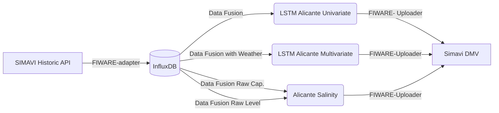
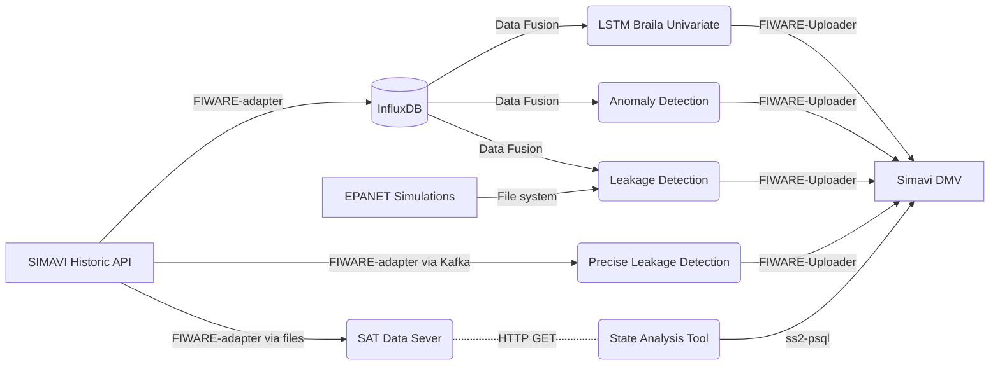

# JSI NAIADES Documentation

## MONITORING Tools (wf-monitor)

#### Monitoring Dataflow

For monitoring o

### Monitoring Dataflow Development Version

Attach to `/bin/bash` on `ubuntu:20.04` container on IRCAI machine (find container id with `docker ps | grep ubuntu`) and attacht to it with `docker exec -it CONTAINER_ID /bin/bash`. If container is running you can skip to the section starting with "Finally, ...".

If it is not running, start it with: `docker run -it --network=host --entrypoint /bin/bash ubuntu:20.04 --name=monitoring_development` (TODO: check if this is true).

If you started the new Ubuntu container, you would have to update it by running:
```bash
apt-get update -y
apt-get install -y python3-pip python3-dev
apt-get install git
```

Next, you would have to clone the `NAIADES/wf-monitor` directory into `/home/` by running:
```bash
cd /home
git clone https://github.com/naiades-jsi/wf-monitor
cd wf-monitor
pip install -r requirements.txt
```

Finally, you run the workflow diagnostics with:
```bash
python3 main.py -w carouge
```

Optionally, you can pipe the output into a log file with a pip `python3 main.py -w carouge &> logs/carouge.log` and view the log with some other tool.

## CAROUGE Deployment

Carouge is deployed on IRCAI machine. All components are dockerized. NAIADES endpoint for input and output are deployed on UDGA.

### CAROUGE Entities for Input data

Entrypoint for data retrieval (at UDGA):
* `http://5.53.108.182:8668/v2/entities/{ENTITY_NAME}?attrs=deviceState,owner,value&lastN=1`

Note: Alternatively, `http://5.53.108.182:8668/` can be replaced with `http://test.naiades-project.eu:8668`.

Entity names:

* FlowerBed 1 &rarr; `urn:ngsi-ld:Device:Device-1f0d`
* FlowerBed 2 &rarr; `urn:ngsi-ld:Device:Device-1f08`
* FlowerBed 3 &rarr; `urn:ngsi-ld:Device:Device-1f10`
* FlowerBed 4 &rarr; `urn:ngsi-ld:Device:Device-1f06`
* FlowerBed 5 &rarr; `urn:ngsi-ld:Device:Device-1efd`
* FlowerBed 6 &rarr; `urn:ngsi-ld:Device:Device-1eff`
* FlowerBed 7 &rarr; `urn:ngsi-ld:Device:Device-1f02`
* FlowerBed 8 &rarr; `urn:ngsi-ld:Device:Device-1efe`
* Meteo Suisse Data &rarr; `urn:ngsi-ld:WeatherObserved:WeatherObserved`
* __OBSOLETE__ &rarr; Weather Station &rarr; `urn:ngsi-ld:WeatherObserved:EnvironmentalStation`

### CAROUGE Influx Schema

Access to Influx:

* Docker network: `host`
* Influx URL: `localhost:8086`
* Organisation: `naiades`
* Bucket: `carouge`
* Influx token (reference!)

Measurements:

* FlowerBed 1 &rarr; `device_1f0d`
* FlowerBed 2 &rarr; `device_1f08`
* FlowerBed 3 &rarr; `device_1f10`
* FlowerBed 4 &rarr; `device_1f06`
* FlowerBed 5 &rarr; `device_1efd`
* FlowerBed 6 &rarr; `device_1eff`
* FlowerBed 7 &rarr; `device_1f02`
* FlowerBed 8 &rarr; `device_1efe`

### CAROUGE Kafka Topics

* Docker network: `host`
* Kafka URL: `localhost:9092`

Fusion topics:

* FlowerBed 1 &rarr; `features_carouge_flowerbed1`
* FlowerBed 2 &rarr; `features_carouge_flowerbed2`
* FlowerBed 3 &rarr; `features_carouge_flowerbed3`
* FlowerBed 4 &rarr; `features_carouge_flowerbed4`
* FlowerBed 5 &rarr; `features_carouge_flowerbed5`
* FlowerBed 6 &rarr; `features_carouge_flowerbed6`
* FlowerBed 7 &rarr; `features_carouge_flowerbed7`
* FlowerBed 8 &rarr; `features_carouge_flowerbed8`

Prediction topics:

* FlowerBed 1 &rarr; `device_1f0d_pred_output`
* FlowerBed 2 &rarr; `device_1f08_pred_output`
* FlowerBed 3 &rarr; `device_1f10_pred_output`
* FlowerBed 4 &rarr; `device_1f06_pred_output`
* FlowerBed 5 &rarr; `device_1efd_pred_output`
* FlowerBed 6 &rarr; `device_1eff_pred_output`
* FlowerBed 7 &rarr; `device_1f02_pred_output`
* FlowerBed 8 &rarr; `device_1efe_pred_output`

### CAROUGE Entities for Output Data

Entrypoint for data retrieval (at UDGA):
* `http://5.53.108.182:8668/v2/entities/{ENTITY_NAME}&lastN=1`

Note: Alternatively, `http://5.53.108.182:8668/` can be replaced with `http://test.naiades-project.eu:8668`.

Entity names:

* FlowerBed 1 &rarr; `urn:ngsi-ld:FlowerBed:FlowerBed-1`
* FlowerBed 2 &rarr; `urn:ngsi-ld:FlowerBed:FlowerBed-2`
* FlowerBed 3 &rarr; `urn:ngsi-ld:FlowerBed:FlowerBed-3`
* FlowerBed 4 &rarr; `urn:ngsi-ld:FlowerBed:FlowerBed-4`
* FlowerBed 5 &rarr; `urn:ngsi-ld:FlowerBed:FlowerBed-5`
* FlowerBed 6 &rarr; `urn:ngsi-ld:FlowerBed:FlowerBed-6`
* FlowerBed 7 &rarr; `urn:ngsi-ld:FlowerBed:FlowerBed-7`
* FlowerBed 8 &rarr; `urn:ngsi-ld:FlowerBed:FlowerBed-8`

Checking fields: `nextWateringDeadline` &rarr; `values[0]`.

### CAROUGE Component Schema


* __FIWARE-adapter__
    * GitHub: https://github.com/naiades-jsi/naiades-toolkit/tree/master/FIWARE-adapter
    * Config file: `productionInflux/downloadScheduler.json`
    * DockerHub: `e3ailab/fiware_adapter_ircai`
    * Starting Docker: `docker run -d --network=host e3ailab/fiware_adapter_ircai`
* __Data Fusion__
    * GitHub: https://github.com/naiades-jsi/data-fusion
    * Use-case Config file: `config_data/config_carouge_*.json` _(Configs are generated on the fly, config file is not needed.)_
    * General secrets file: `secrets.json` &larr; copy `secrets.example.json` (and update secrets)
    * Starting: `python3 index.NAIDES.carouge_w.py`
    * DockerHub: `e3ailab/df_carouge_w_ircai`
    * Starting Docker: `docker run -d --network=host e3ailab/df_carouge_w_ircai`
* __Carouge Watering__
    * GitHub: https://github.com/naiades-jsi/Carouge
    * Config files:
        * Modeling (consumer): `main/config_deployment.json`
        * Scheduling: `schedule/schedule_real_data.json`
    * Starting: `python3 main.py -cc config_real_data.json -cs schedule_real_data.json`
    * DockerHub: `e3ailab/carouge_ircai`
    * Starting docker: `docker run -d --network=host e3ailab/carouge_ircai`
* __FIWARE-uploader__
    * GitHub: https://github.com/gal9/FIWARE-uploader
    * Config file: `config/deployment/carouge_watering.json`
    * Starting: `python3 main.py -c deployment/carouge_watering.json`
    * DockerHub: `e3ailab/uploader_carouge_watering_ircai`
    * Starting docker: `docker run -d --network=host e3ailab/uploader_carouge_watering_ircai`

Run everything for Carouge:
´´´bash
docker run -d --network=host e3ailab/fiware_adapter_ircai
docker run -d --network=host e3ailab/df_carouge_w_ircai
docker run -d --network=host e3ailab/carouge_ircai
docker run -d --network=host e3ailab/uploader_carouge_watering_ircai
´´´


## ALICANTE Deployment

### ALICANTE Entities for Input data

### ALICANTE Component Schema


* __FIWARE-adapter__
    * same as above
* __Data Fusion__ _[consumption, NO weather]_
    * GitHub: https://github.com/naiades-jsi/data-fusion
    * Use-case Config file: `config_data/alicante_*_flow_forecasting_config.json` _(Configs are generated on the fly, config file is not needed.)_
    * General secrets file: `secrets.json` &larr; copy `secrets.example.json` (and update secrets)
    * Starting: `python3 index.NAIDES.alicante_forecasting.py`
    * DockerHub: `e3ailab/df_alicante_forecasting_ircai`
    * Starting Docker: `docker run -d --network=host e3ailab/df_alicante_forecasting_ircai`
* __Data Fusion__ _[consumption, weather]_
    * DockerHub: `e3ailab/df_alicante_forecasting_w_ircai`
    * Starting Docker: `docker run -d --network=host e3ailab/df_alicante_forecasting_w_ircai`
* __Data Fusion__ _[salinity, raw]_
    * Starting: `python3 index.NAIDES.alicante_features_raw.py`
    * DockerHub: `e3ailab/df_alicante_features_raw_ircai`
    * Starting Docker: `docker run -d --network=host e3ailab/df_alicante_features_raw_ircai`
* __FIWARE-uploader__ (TODO)
    * Config file: `config/deployment/alicante_consumption.json`
    * DockerHub: `e3ailab/uploader_alicante_consumption_ircai`
    * Starting docker: `docker run -d --network=host e3ailab/uploader_alicante_consumption_ircai`


Run everything for Alicante:
```bash
// consumption
docker run -d --network=host e3ailab/df_alicante_forecasting_ircai
docker run -d --network=host e3ailab/lstm_alicante_univariate_ircai
docker run -d --network=host e3ailab/df_alicante_forecasting_w_ircai
docker run -d --network=host e3ailab/lstm_alicante_multivariate_ircai
docker run -d --network=host e3ailab/uploader_alicante_consumption_ircai

// salinity
docker run -d --network=host e3ailab/df_alicante_features_raw_ircai
docker run -d --network=host e3ailab/anomaly_detection_alicante_salinity_ircai
docker run -d --network=host e3ailab/uploader_alicante_salinity_ms_ircai
```

### ALICANTE Entities for Output Data

Entrypoint for data retrieval (at Simavi):
* `http://naiades.simavi.ro:1026/v2/entities/{ENTITY_NAME}&lastN=1`

#### Consumption Prediction

Entity names:

* `urn:ngsi-ld:WaterConsumption:Spain-Alicante-alipark-1h` (1 ... 23h, 1d ... 7d)
* `urn:ngsi-ld:WaterConsumption:Spain-Alicante-autobuses-1h`
* `urn:ngsi-ld:WaterConsumption:Spain-Alicante-benalua-1h`
* `urn:ngsi-ld:WaterConsumption:Spain-Alicante-diputacion-1h`
* `urn:ngsi-ld:WaterConsumption:Spain-Alicante-mercado-1h`
* `urn:ngsi-ld:WaterConsumption:Spain-Alicante-montaneta-1h`
* `urn:ngsi-ld:WaterConsumption:Spain-Alicante-rambla-1h`

#### Salinity Intrusion

Entity names:

* 001_36_level-MetaSignal ??
* EA002_36
    * `urn:ngsi-ld:Device:RO-EA002_36_conductivity-MetaSignal`
    * `urn:ngsi-ld:Device:RO-EA002_36_conductivity_up-MetaSignal`
* EA003_21
    * `urn:ngsi-ld:Device:RO-EA003_21_conductivity-MetaSignal`
    * `urn:ngsi-ld:Device:RO-EA003_21_conductivity_up-MetaSignal`
* EA003_36
    * `urn:ngsi-ld:Device:RO-EA003_36_conductivity-MetaSignal`
    * `urn:ngsi-ld:Device:RO-EA003_36_conductivity_up-MetaSignal`
* EA004_21
    * `urn:ngsi-ld:Device:RO-EA004_21_conductivity-MetaSignal`
    * `urn:ngsi-ld:Device:RO-EA004_21_conductivity_up-MetaSignal`
* EA005_21
    * `urn:ngsi-ld:Device:RO-EA005_21_conductivity-MetaSignal`
    * `urn:ngsi-ld:Device:RO-EA005_21_conductivity_up-MetaSignal`
* EA007_36
    * `urn:ngsi-ld:Device:RO-EA007_36_conductivity-MetaSignal`
    * `urn:ngsi-ld:Device:RO-EA007_36_conductivity_up-MetaSignal`
* EA008_36
    * `urn:ngsi-ld:Device:RO-EA008_36_conductivity-MetaSignal`
    * `urn:ngsi-ld:Device:RO-EA008_36_conductivity_up-MetaSignal`

Checking fields: `dateObserved` &rarr; `value[0]`. Note, this is Context Broker.

## BRAILA Deployment

TODO



* __FIWARE-adapter__ (same as above)
* __EPANET simulations__
    * Source: files generated by partners
* __Data Fusion__ (same as above, except - see below)
    * Use-case Config file: `config_data/config_TODO.json` _(Configs are generated on the fly, config file is not needed.)_
    * Starting: `python3 index.NAIDES.TODO.py`
    * DockerHub: `e3ailab/TODO`
    * Starting Docker: `docker run -d --network=host e3ailab/TODO`
* __State Analysis Tool (SAT)__
    * GitHub: https://github.com/JozefStefanInstitute/StreamStory2
    * Deploy: on Atena server (not IRCAI); no DockerHub
    * Starting Docker Ecosystem: `docker-compose up`
* __SAT Data Server__ (State Analysis Tool's Data Server)
    * GitHub: https://github.com/yoozze/naiades-data
    * Config file: `configs/naiades/config.json`
    * Deploy: on Atena server (not IRCAI); no DockerHub
    * Starting Docker: `docker-compose up`
* __FIWARE-uploader__ (same as above)
    * GitHub: https://github.com/gal9/FIWARE-uploader
    * Config file:
        * Consumption: `config/deployment/braila consumption.json`
        * Anomaly detection: `config/deployment/braila_ad_ms.json`
        * TODO (Gal)
    * Starting: `python3 main.py -c deployment/carouge_watering.json`
    * DockerHub: `e3ailab/uploader_carouge_watering_ircai`
    * Starting docker: `docker run -d --network=host e3ailab/uploader_carouge_watering_ircai`
* __ss2-psql__
    * GitHub: https://github.com/naiades-jsi/ss2-psql
    * Config: `config/config.json`
    * Starting: `python3 index.py`
    * Docker start: `sudo docker run -it --rm -v /mnt/data/projects/naiades/ss2-psql/services:/home/app --network=streamstory_streamstory python:3.9 /bin/bash`
    * Deploy: on Atena server (not IRCAI); no DockerHub
    * Location: `/mnt/data/projects/naiades/ss2-psql`

Run everything for Braila:

```bash

// consumption
docker run -d --network=host e3ailab/df_braila_forecasting_ircai
docker run -d --network=host e3ailab/lstm_braila_univariate_ircai
docker run -d --network=host e3ailab/uploader_braila_ad_ms_ircai
docker run -d --network=host e3ailab/uploader_braila_ad_ircai
// MISSING uploader?!

```


### BRAILA Entities for Output Data

Entrypoint for data retrieval (at Simavi):
* `http://naiades.simavi.ro:1026/v2/entities/{ENTITY_NAME}&lastN=1`

#### Consumption Prediction

Entity names:

* `urn:ngsi-ld:WaterConsumption-Romania:Romania-Braila-flow211206H360_1h` (1..23h, 1d ... 7d)
* flow211306H360
* flow318505H498

#### Anomaly Detection

Entity names:

* FlowerBed 1 &rarr; `urn:ngsi-ld:Alert:RO-Braila-pressure_5770`
* 5771
* 5772
* 5773
* FlowerBed 1 &rarr; `urn:ngsi-ld:Device:RO-211206H360-MetaSignal`
* 211306H360
* 318505H498

#### Leakages

TODO

* `urn:ngsi-ld:Alert:RO-Braila-leakageGroup`

#### Accurate Leakage

TODO

# Additional Infrastructure

## Docker

### Building an Image

Deployment is achieved via dockerized components. Docker should prepared on a local machine! Each component has a `Dockerfile` in the root directory. As many repositories are used to create multiple component, `Dockerfile` should be edited before building an image. Usually, the user has to editi the `[CMD]` line in the `Dockerfile` in order to reflect the component being built. Mostly, various options are commented in the `Dockerfile`.

To build the image the command should be run: `docker build -t DOCKERHUB_NAME .` (note the trailing dot in the command!). For Carouge those commands are:

* `docker build -t e3ailab/fiware_adapter_ircai .`
* `docker build -t e3ailab/df_carouge_w_ircai .`
* `docker build -t e3ailab/carouge_ircai .`
* `docker build -t e3ailab/uploader_carouge_watering_ircai .`

### Deploying an Image

After the image is being built (usually on a local machine) we have to push it to the DockerHub with: `docker push DOCKERHUB_NAME`. In order for this to work, you would have to log in into DockerHub with `docker login`.

After this, we move to the IRCAI machine. As we usually need to update the deployment, we should first run:

* `docker pull DOCKERHUB_NAME`

and finally:

* `docker run -d --network="host" DOCKERHUB_NAME`

### Useful hints
For Windows server (IRCAI) you can use `docker logs <CONTAINER_ID> 2>&1 | findstr /C:"ERROR"` to only display lines from docker logs containing string `"ERROR"`.

## DockerHub `e3ailab`

DockerHub password is available at Aleš or Mark.

## InfluxDB

### Starting InfluxDB on IRCAI machine

InfluxDB is running on IRCAI machine. Start with `docker-compose up` on `D:\Demos\NAIADES\InfluxDB`.
We are using version 2.0.x. We create initial user with corresponding NAIADES token.

### Setup of InfluxDB

Log into the container and add the buckets:
```bash
influx bucket create -n alicante -o naiades -r 0
influx bucket create -n braila -o naiades -r 0
influx bucket create -n carouge -o naiades -r 0
```

### Integrated Chronograph

Data can be accesed via integrated viewer at http://localhost:8086 (Chronograph).

### Obtaining InfluxDB Token

Token can be obtained on IRCAI machine in the InfluxDB container. User has to identify InfluxDB docekr file by runing `docker ps`. The result would usually be something like this:

```
CONTAINER ID   IMAGE                                               COMMAND                  CREATED        STATUS        PORTS                                                 NAMES
ba4e70a80576   e3ailab/carouge_ircai                               "python3 main.py -cc…"   2 days ago     Up 2 days                                                           suspicious_ellis
9d52325f0039   e3ailab/df_carouge_w_ircai                          "python3 index.NAIAD…"   2 days ago     Up 2 days                                                           upbeat_wing
75d42f41218f   e3ailab/uploader_carouge_watering_ircai             "python3 main.py -c …"   7 days ago     Up 7 days                                                           suspicious_feistel
281b7ca5e2b9   influxdb:latest                                     "/entrypoint.sh infl…"   5 months ago   Up 4 months   0.0.0.0:8086->8086/tcp                                influxdb
```

ContainerID for InfluxDB is `281b7ca5e2b9` in this case. To enter the container you have to run: `docker exec -it 281b7ca5e2b9 /bin/bash`.

Once in the container, run `influx auth list`; you have to choose the token for the `naiades` user.


## Kafka

Kafka is running on IRCAI machine. Start with `docker-compose up` on `D:\Demos\NAIADES\Kafka`.
